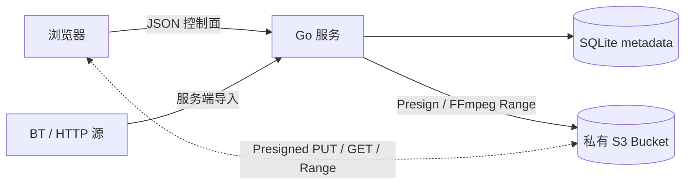

# Revaro 1.0.0

revaro 是一个轻量、单用户、自托管的私人 S3 网盘。SQLite 是逻辑文件系统和 metadata source of truth；每个逻辑文件在 S3 中对应一个 `blobs/<随机 UUID>` 不透明完整对象，真实文件名、目录和回收站位置不会进入 Object Key。浏览器通过短效 Presigned URL 直接上传、下载和 Range 预览，Go 服务只处理认证、元数据与 S3 控制面。服务端还内置 BT/直链离线下载、EPUB/TXT 阅读器、音视频播放器、字幕、播放进度、在线解压、缩略图和文本编辑器。

## 架构



- 用户路径与 S3 Object Key 完全解耦。新文件仅使用 `blobs/<UUID>`，移动、改名、复制到回收站只修改 SQLite，不执行 `CopyObject`。
- 小文件使用 Presigned PUT；大文件使用 S3 Multipart。Multipart part 只是传输分片，Complete 后仍是一个完整、支持原生 HTTP Range 的 S3 object。
- 普通下载、图片、PDF、文本以及浏览器原生支持的音视频返回短效 Presigned GET，让 Wasabi 直接承担流量、seek、取消和 backpressure。
- 移动和重命名只更新 SQLite，不执行 `CopyObject`。
- Rust media engine 通过 S3 Range reader 将 blob 交给精简 libav。fMP4 优先零复制重封装，必要时转 AAC；不兼容视频进入有界 HLS H.264/AAC 转码。seek/关闭会取消旧任务与 Range 请求。
- 删除会把文件或整棵目录树软删除到回收站；默认保留 30 天，永久删除后的无引用 blob 和缩略图由 GC 回收。

## 快速开始（Docker / Podman）

仓库内的 Compose 配置默认拉取已发布的多架构镜像 `ghcr.io/vesperglow/revaro:latest`，同时启动 MinIO，并自动创建私有 Bucket 和开发用 CORS。

```bash
cp .env.example .env
# 至少修改 S3_SECRET_KEY；ADMIN_PASSWORD 留空会自动生成一次性密码
docker compose up -d
docker compose logs revaro
```

打开 <http://localhost:8080>。如果没有配置 `ADMIN_PASSWORD`，首次成功启动会把管理员用户名和随机密码写入数据卷中的 `/data/initial-admin-credentials`（权限 `0600`）；登录并修改密码后删除该文件。MinIO 控制台位于 <http://localhost:9001>。

Podman 用户可以运行：

```bash
podman compose up -d
```

也可以直接拉取镜像：

```bash
docker pull ghcr.io/vesperglow/revaro:latest
```

每次 `main` 更新会发布 `latest`；语义化版本 Git tag 会同时发布完整、次要和主版本镜像标签。例如 `v1.0.0` 会发布 `1.0.0`、`1.0`、`1` 和 `latest`。若 GHCR Package 尚未设为 Public，请先登录 GHCR，或在 GitHub Package 设置中将其改为公开。

生产环境应将 `APP_BASE_URL` 改为实际 HTTPS 地址（`COOKIE_SECURE` 会据此自动启用），使用高熵密码，并将 Bucket CORS 的来源改为同一个 HTTPS Origin。Compose 的 Web 管理端口默认只监听 `127.0.0.1`，应通过同机 HTTPS 反向代理对外提供服务；自带 MinIO 主要用于单机部署和本地体验，也可以删除 `minio` / `minio-init` 服务并指向已有 S3-compatible 存储。

内置 BT 默认额外公开宿主机 `51413/tcp` 与 `51413/udp`，以便接受入站节点连接；Web 管理端口仍只绑定 `127.0.0.1`。云防火墙需要放行对应的 TCP/UDP 端口。若不需要离线下载，设置 `BT_ENABLED=false`，并从 Compose 中移除这两条端口映射。

## 从源码构建

需要 Go 1.25+ 和 Node.js 24+。前端产物会写入 `internal/webui/dist` 并由 `go:embed` 打进二进制；该目录**不提交 git**（由 `npm run build` 生成本地副本），因此 clone 后必须先构建前端再运行 Go 构建或测试。

```bash
cd web
npm ci
npm run build
cd ..
go test ./...
go build -o revaro ./cmd/server
```

从当前源码构建容器并让 Compose 使用本地镜像：

```bash
docker build -t revaro:local .
REVARO_IMAGE=revaro:local docker compose up -d
```

运行：

```bash
set -a; . ./.env; set +a
./revaro
```

## 配置

| 变量 | 默认值 | 说明 |
|---|---:|---|
| `APP_ADDR` | `:8080` | HTTP 监听地址 |
| `APP_DATA_DIR` | `/data` | SQLite 数据目录 |
| `APP_WORK_DIR` | `/work` | Revaro 专用可删除工作目录（HLS、合并、解压、BT 未完成 piece）；启动和任务结束时安全清理已识别的遗留目录，勿与持久数据混放 |
| `APP_BASE_URL` | `http://localhost:8080` | 用于同源写请求校验 |
| `COOKIE_SECURE` | 根据 Base URL | 生产必须为 `true`；HTTP 本地开发设为 `false` |
| `ADMIN_USERNAME` | `admin` | 首次初始化使用的管理员用户名 |
| `ADMIN_PASSWORD` | 随机生成 | 可选；设置时至少 12 字符，未设置时首次启动生成一次性密码；只保存 Argon2id hash |
| `TRUSTED_PROXIES` | 空 | 可信反向代理 CIDR 列表（逗号分隔）；仅这些来源的 `X-Forwarded-For` 会用于登录限流 |
| `S3_ENDPOINT` | AWS 默认 | S3-compatible endpoint；AWS S3 可留空 |
| `S3_PUBLIC_ENDPOINT` | 与 `S3_ENDPOINT` 相同 | 浏览器和 FFmpeg 可访问的 Presigned URL endpoint |
| `S3_REGION` | `us-east-1` | Bucket region |
| `S3_BUCKET` | 无 | Bucket 名称 |
| `S3_ACCESS_KEY` | 无 | 仅后端使用 |
| `S3_SECRET_KEY` | 无 | 仅后端使用 |
| `S3_PATH_STYLE` | `false` | MinIO 等存储通常设为 `true` |
| `S3_PROXY_TRANSFERS` | UpCloud 为 `true`，其他为 `false` | 仅影响升级前的旧整对象；新 `blobs/` 始终直连公网 S3 |
| `PRESIGN_EXPIRES` | `15m` | 上传、下载和预览 URL 有效期 |
| `MEDIA_CACHE_CAPACITY` | `2147483648` | 服务端工作缓存的全局磁盘预算（managed cache + FFmpeg HLS fallback workspace）；已完成 HLS workspace 另有 20 分钟 idle TTL |
| `UPLOAD_EXPIRES` | `24h` | 未完成上传的清理期限，也决定垃圾回收宽限期下限 |
| `TRASH_RETENTION` | `720h` | 回收站保留期限（30 天）；到期后自动永久删除，`0` 表示禁用自动清理 |
| `GC_INTERVAL` | `1h` | 周期孤儿对象回收间隔；`0` 表示禁用周期扫描（回收站到期删除仍会触发一次回收） |
| `BT_ENABLED` | `true` | 启用内置磁力 / `.torrent` 离线下载 |
| `BT_LISTEN_PORT` | `51413` | 容器内 BT TCP/UDP 监听端口；Compose 的宿主机端口由 `BT_PORT` 设置 |
| `BT_MAX_FILES` | `10000` | 单个种子允许的最大文件数 |
| `BT_MAX_TOTAL_SIZE` | `1099511627776` | 单个种子允许的最大总大小（默认 1 TiB） |
| `BT_METADATA_TIMEOUT` | `30m` | 磁力链接等待元数据的最长时间 |
| `BT_STALE_AFTER` | `48h` | 失败任务及其临时分片的保留时间 |
| `BACKUP_ENABLED` | `true` | 自动把 SQLite 一致性快照备份到 S3 的 `revaro-backups/database/`；`false` 只关闭备份，不影响主服务 |
| `BACKUP_INTERVAL` | `24h` | 两次自动备份的最小间隔（≥1m）；停机跨过多个周期后，启动时只补做一次最新备份 |
| `BACKUP_RETENTION` | `14` | S3 中保留的最近备份数量，成功上传新备份后自动清理更旧的备份 |
| `FLOW_CACHE_TTL` | `720h` | S3 中孤立 reader flow 产物的保留时间；`0` 表示不按 TTL 淘汰 |
| `FLOW_CACHE_CAPACITY` | `1073741824` | S3 中 reader flow 产物的容量预算；`0` 表示不按容量淘汰 |

### S3 公网直连要求

新 blob 的上传、下载、预览和媒体 Range 都直接访问 `S3_PUBLIC_ENDPOINT`，因此 endpoint 必须能被浏览器和运行 FFmpeg 的主机访问，Bucket 仍保持私有并配置下文 CORS。UpCloud 的 checksum 兼容选项仍会自动启用，但“仅私网、关闭 Public access”的旧代理部署不适用于新上传模型。

管理员设置只在数据库第一次初始化时读取。之后修改环境变量不会重置已有密码，避免部署配置漂移意外改密。随机密码只在新数据库首次成功启动时写入一次；可通过右上角头像进入账户设置修改用户名和密码，修改后所有现有会话都会失效。

首次凭据不会进入容器日志，而是写入 `APP_DATA_DIR/initial-admin-credentials`。该文件权限为 `0600`，仍应在首次登录并修改密码后立即删除；也可以在首次启动前显式配置 `ADMIN_PASSWORD`，避免生成凭据文件。

如果已有数据库的管理员凭据丢失，不要删除数据卷。停止服务后运行一次恢复命令，它会保留文件与元数据、撤销已有会话，并在终端打印新的随机凭据：

```bash
docker compose stop revaro
docker compose run --rm --no-deps revaro reset-admin
docker compose start revaro
```

可在命令末尾指定新用户名，例如 `revaro reset-admin owner`。恢复密码同样只显示一次，登录后请立即从右上角账户设置中修改。账户设置也支持上传、更换和移除个人头像；头像文件保存在同一个私有 S3 Bucket 中，大小限制为 2 MiB。

## S3 权限

应用凭据只需操作指定 Bucket。AWS IAM 策略示例（替换 Bucket 名）：

```json
{
  "Version": "2012-10-17",
  "Statement": [
    {
      "Effect": "Allow",
      "Action": ["s3:ListBucket"],
      "Resource": ["arn:aws:s3:::my-private-revaro"]
    },
    {
      "Effect": "Allow",
      "Action": [
        "s3:GetObject",
        "s3:PutObject",
        "s3:DeleteObject",
        "s3:AbortMultipartUpload"
      ],
      "Resource": ["arn:aws:s3:::my-private-revaro/*"]
    }
  ]
}
```

Bucket 必须保持私有。浏览器访问依赖 Presigned URL，而不是公开读取权限；但 `S3_PUBLIC_ENDPOINT` 必须从浏览器可达。

## Bucket CORS

浏览器会直接 PUT/GET S3 blob，因此必须配置 CORS。生产环境不要使用 `AllowedOrigins: ["*"]`，应只允许网盘 Origin：

```json
[
  {
    "AllowedOrigins": ["https://drive.example.com"],
    "AllowedMethods": ["GET", "HEAD", "PUT"],
    "AllowedHeaders": ["*"],
    "ExposeHeaders": ["ETag"],
    "MaxAgeSeconds": 3600
  }
]
```

`ExposeHeaders` 必须包含 `ETag`，浏览器要把每个 Multipart part 的 ETag 交回 CompleteMultipartUpload。凭据始终只在后端，浏览器只能使用短效签名 URL。

## API

除健康检查和登录外，所有 API 都要求 `HttpOnly` Session Cookie。

| 方法 | 路径 | 用途 |
|---|---|---|
| `GET` | `/healthz`、`/readyz` | 存活与 SQLite 就绪检查 |
| `POST` | `/api/auth/login`、`/api/auth/logout` | 登录与注销 |
| `GET` | `/api/auth/me` | 当前管理员 |
| `GET` / `PUT` / `DELETE` | `/api/profile/avatar` | 读取、更新或移除个人头像 |
| `GET` | `/api/storage/stats` | 所有 ready 文件的逻辑总大小与文件数 |
| `GET` | `/api/files/{id}` | 文件/目录与面包屑 |
| `GET` | `/api/files/{id}/children` | 目录内容 |
| `POST` | `/api/directories` | 新建目录 |
| `PATCH` | `/api/files/{id}` | 重命名、移动或同时执行 |
| `DELETE` | `/api/files/{id}` | 把文件或目录树移入回收站 |
| `GET` | `/api/trash` | 列出回收站根项目 |
| `POST` | `/api/trash/{id}/restore` | 恢复项目到原位置（原目录不存在时回到根目录） |
| `DELETE` | `/api/trash/{id}` | 永久删除回收站项目 |
| `DELETE` | `/api/trash` | 清空回收站 |
| `GET` | `/api/files/{id}/download` | 302 到 Presigned 下载 URL |
| `POST` | `/api/files/batch-download/prepare` | 用 logical file ID 创建短效、单次使用的批量下载 token |
| `GET` | `/api/files/batch-download/{token}` | 流式返回所选文件的 ZIP；object key 不进入公共 API |
| `GET` | `/api/files/{id}/preview` | 302 到图片预览 URL |
| `GET` / `PUT` | `/api/files/{id}/content` | 读取或保存可编辑文本文件，含 ETag 冲突保护 |
| `GET` | `/api/files/{id}/book` | 阅读器元数据：格式、标题、封面与目录 |
| `GET` | `/api/files/{id}/book/assets/{n}` | EPUB 内嵌图片 |
| `GET` | `/api/files/{id}/book/cover` | EPUB 内嵌封面 |
| `GET` / `PUT` | `/api/files/{id}/book/progress` | 阅读进度（readingAnchor） |
| `GET` | `/api/files/{id}/book/flow` | 连续 reading flow manifest（spine/chunk/TOC，随内容缓存） |
| `GET` | `/api/files/{id}/book/flow/chunks/{n}` | reading flow 第 n 个 chunk 的 HTML 片段（不可变缓存） |
| `GET` | `/api/files/{id}/thumbnail` | 持久化缩略图（图片/EPUB 封面服务端生成、视频由 Rust/libav 抽帧，不可变缓存） |
| `POST` | `/api/documents` | 在指定目录新建 UTF-8 文本文档 |
| `GET` / `POST` / `DELETE` | `/api/files/{id}/share` | 查询、创建/重置或停止公开分享 |
| `GET` | `/s/{token}` | 无需登录，通过稳定分享地址读取文件 |
| `POST` | `/api/uploads` | 创建 single/multipart blob 上传；小文件直接返回 Presigned PUT |
| `POST` | `/api/uploads/{id}/parts` | 分批为 Multipart part 签发 Presigned PUT（每批最多 100） |
| `POST` | `/api/uploads/{id}/complete` | CompleteMultipartUpload/HeadObject 校验后切换为 `ready` |
| `DELETE` | `/api/uploads/{id}` | 取消并清理待上传元数据 |
| `POST` | `/api/audio-merges` | 按给定顺序和可选封面创建后台音频合并任务，可选 FLAC、ALAC 或 AAC |
| `GET` | `/api/audio-merges` | 查询当前进程中的全部后台音频合并任务 |
| `GET` / `DELETE` | `/api/audio-merges/{id}` | 查询进度、取消任务或清除已完成记录 |
| `GET` | `/api/files/{id}/audio` | 获取合并音频的章节、封面和流式播放信息 |
| `GET` | `/api/files/{id}/audio/stream` | 支持 HTTP Range 的浏览器兼容音频流 |
| `GET` | `/api/files/{id}/video` | 获取与视频同名的外挂字幕轨 |
| `GET` | `/api/files/{id}/video/subtitles/{subtitle}` | 把 VTT/SRT/ASS/SSA 字幕作为 WebVTT 返回 |
| `POST` | `/api/files/{id}/video/fmp4` | 创建不重新编码音视频的临时 fragmented MP4 remux 会话 |
| `GET` | `/api/video/fmp4/{session}/stream` | 把 FFmpeg stream-copy 产生的 fragmented MP4 stdout 直接流式送入 MSE |
| `DELETE` | `/api/video/fmp4/{session}` | 停止会话并取消 FFmpeg、源 Range 请求及后续块读取 |
| `POST` | `/api/files/{id}/video/hls` | 为浏览器不兼容的视频启动按需 FFmpeg HLS 流 |
| `GET` / `PUT` | `/api/files/{id}/media/progress` | 读取或保存音频/视频的跨设备播放进度 |
| `POST` | `/api/files/{id}/extract` | 创建安全检查后后台执行的在线解压任务 |
| `GET` | `/api/archive-jobs/{id}` | 查询在线解压状态与生成的目录 |
| `POST` / `GET` | `/api/downloads` | 创建磁力、`.torrent` 或 HTTP(S) 直链离线下载、列出任务 |
| `GET` / `DELETE` | `/api/downloads/{id}` | 获取文件列表与进度、删除任务及临时分片 |
| `POST` | `/api/downloads/{id}/start` | 选择种子内文件并开始下载 |
| `POST` | `/api/downloads/{id}/pause`、`/resume` | 暂停或继续下载 |

## 内置磁力与 BT 下载

顶部“离线下载”中心接受 `magnet:`、`.torrent` 和普通 HTTP(S) 直链。任务分别显示下载和导入进度；完成数据由服务端流式完成 S3 Multipart，最终仍是单个 blob，不要求 VPS 本地磁盘容纳完整文件。

通过 BT piece hash 校验的临时分片仍使用 `bt-temp/<infohash>/<piece>` 以支持断点恢复。全部完成后，服务端从分片流式组装 `blobs/` 对象，原子写入文件树，随后删除临时分片并退出 swarm；没有完成后的做种模式。

为了防止恶意种子把服务当作内网探测器，BT 节点、HTTP Tracker 与 WebSeed 的私有、回环、链路本地、CGNAT 和保留地址都会被拒绝。离线下载仍会访问公网第三方节点，部署者应遵守所在地法律和内容授权要求；应用不会绕过 Tracker、站点或内容本身的访问控制。

## 公开分享

文件操作区的“分享”按钮可以创建一个高熵公开链接。链接长期有效，任何持有者无需登录即可访问；重新生成链接会立即废弃旧地址，“停止分享”会撤销当前地址。文件进入回收站后分享立即不可访问，恢复后重新生效；永久删除会同时删除分享记录。

公开入口对 blob 每次签发短期 S3 URL 并返回 302。分享地址是稳定的逻辑文件地址，每次访问都会记录掩码后的 token 前缀。

分享 URL 等同于访问凭据，请不要发布到公开仓库、聊天群或日志中。若怀疑泄露，请立即重新生成或停止分享。

## 内置阅读器

点击 `.epub` 文件（或超过 1 MiB 的 `.txt` 文件）即可在网盘里直接阅读；阅读器复用本服务的认证、文件树与 S3 blob：

- **服务端解析与连续 reading flow**：EPUB 解包、OPF/spine、目录（EPUB3 nav + NCX 回退）、封面抽取全部在 Go 服务端完成；正文按白名单重建 HTML（脚本、事件处理器、`javascript:` 等危险内容按构造不会出现），图片在服务端读出**固有尺寸并写入 width/height**（分页不跳版），内嵌图片改写为带内容版本参数的 `/api/files/{id}/book/assets/{n}?v=…` 分发（不可变，可长期缓存）。解析对解压总量设硬上限（256 MiB），恶意的高压缩比 EPUB（zip bomb）会被拒绝而不是耗尽内存。TXT 自动识别 UTF-8/GBK 编码，并按“第…章”式标题生成目录。整本书再被拼成一条**连续、标准化、可缓存的 reading flow**，按自然 DOM 边界切成适量 chunk 存对象存储（`flows/` 前缀，随内容哈希与版本固定）；chunk 不是页面，不与任何视口/字号绑定。
- **解析缓存**：解析结果按稳定的 object key/ETag 缓存，最近 4 本 keep-alive；文件内容更新会换 key，不会复用陈旧解析。flow 产物同样以内容为键（`FLOW_CACHE_TTL`/`FLOW_CACHE_CAPACITY` 控制回收），重开书不重新生成。
- **客户端原生分页（移动端友好）**：**无 Chromium、无服务端排版**。客户端把当前 spine 的稳定排版前缀到当前位置、再加 3 个预取 chunk 装进一个连续多栏 DOM（图片与文字处于同一排版上下文，跨 spine 内容无缝接排），由浏览器原生 CSS columns 完成最终分页；翻页只做合成层 transform（热路径零网络、零重排）。窗口变化是**增量 DOM 更新**（只 append 新 chunk、remove 确认已离窗的 chunk，保留其余子树原样不动），PageCache 另保留最近 24 个 chunk；`will-change: transform` 只在拖动/翻页动画期间开启并在结束后释放，避免大图旁文字在 Android Chrome 被常驻合成而发糊。桌面点击左右热区、键盘方向键/PageUp/PageDown/空格翻页，移动端左右滑动跟手翻页（快速轻扫或拖过 1/4 屏判定）。
- **进度与即时重排**：阅读进度 = readingAnchor（连续 flow 上的块 + 块内文本位置，不依赖页码），防抖保存并随页面关闭/失焦落盘；改字号/行距/旋转/横竖屏只在客户端重新分页，服务端零参与、不重新生成内容；明暗主题只换 CSS 变量，永不重排。
- 上限：EPUB 128 MiB、TXT 16 MiB；更大的文件请下载后离线阅读。
- **镜像体积**：发布镜像不安装 Debian 完整 ffmpeg。构建阶段用 multi-stage 自编译**精简 FFmpeg 5.1**（libav* .59，与 Rust 数据平面 soname/ABI 一致；仅 x264/x265 两个外部编码器、静态内链，其余组件全部走 FFmpeg 内建实现），运行层只带 `ffmpeg`/`ffprobe` 与少量 `.so`。Rust 数据平面在构建与测试时直接链接这套精简 libav，镜像因此不再携带 Mesa/libLLVM/libmfx/flite/codec2 等无关依赖树（数百 MB）。

## 文档编辑器点击 `.md`、`.markdown`、`.txt`、`.yaml`、`.yml`、`.json`、`.toml`、`.ini`、`.conf`、`.log` 或 `.csv` 文件即可打开编辑器；当前目录也可以直接新建文档。Markdown 支持编辑、分栏和安全过滤后的预览，`Ctrl/⌘ + S` 可保存。

编辑器只接受 UTF-8 且不超过 1 MiB 的文件。保存会写入新的随机 blob，再以 ETag 做乐观并发更新；若文件已被其他页面修改，旧编辑会收到 `409 Conflict`。旧 blob 由 GC 回收，已有分享链接无需重建。

## 媒体预览

当前目录中的图片、GIF 和视频会组成一个循环媒体序列。桌面端使用收敛后的左右按钮或键盘方向键切换；移动端不显示翻页按钮，直接左右滑动。图片支持滚轮、双击、按钮与双指手势缩放，放大后可拖动查看。视频使用画面内叠层控件与自动隐藏的进度、音量、字幕、全屏控制，并把持久化视频缩略图作为播放封面。浏览器原生支持的视频仍优先走 Range 直放；MKV 等容器会先由 FFmpeg 以 `-c copy` 重封装为 fragmented MP4，再通过 MSE 交给浏览器/GPU 解码，HEVC 不会在这条路径中转成 H.264。前端同时检查 MSE MIME 支持和 Media Capabilities；编码、音频或移动端硬解不兼容，以及 MSE 追加/解码失败时，会携带明确原因自动回退到原有 HLS。HLS session cache、相近起点复用与独立字幕缓存继续保留，完整进度条可跨尚未生成的区间重新起流跳转。音频文件会打开独立播放器。预览弹窗点击媒体周围的空白区域即可关闭，底部下载按钮始终下载原始文件。

文件网格与列表为图片、视频和 EPUB 提供持久化缩略图。视频 FFmpeg 直接对 S3 blob 发 Range。缩略图存于 `thumbs/` 前缀并由 GC 管理。

所有新媒体都使用 S3 原生 Range；只有实时 remux/transcode 的 stdout/HLS 数据经过 Revaro。

应用识别 JPEG、PNG、WebP、GIF、AVIF，以及 MP4、WebM、OGV、MOV、M4V、MKV、AVI、FLV、WMV、MPG/MPEG、TS/M2TS/MTS、MP3、WAV、OGG、M4A、AAC、FLAC、Opus、WMA、AIFF、APE 等常见扩展名。视频会自动匹配同目录及两层 `Subs`/`Subtitles` 子目录中同基名或带语言后缀的 `.vtt`、`.srt`、`.ass`、`.ssa`，转换为浏览器可选的 WebVTT 字幕轨；原始视频与字幕文件不会被改写。

### 音频合并

同时选中 2–256 个音频文件后可合并为 FLAC、ALAC 或 AAC。服务端通过 Wasabi Range 准备源文件，交给 FFmpeg 后把成品写成一个新 blob；章节、封面、匹配的 WebVTT 与播放进度行为保持不变。

合并结果使用分节播放器：上半区左侧显示封面和当前分节，右侧同步显示字幕并可切换章节列表，下半区集中放置进度和播放控制；支持上一节/下一节跳转、前后快进、倍速播放，并自动保存上次播放位置。播放器通过 HTTP Range 直接读取合并后的原始 FLAC 或 ALAC `.m4a`，只请求起播或跳转所需的字节，不生成 AAC 播放副本，也无需先下载完整的数小时文件。ALAC 能否播放取决于访问浏览器自身的解码支持。

FLAC 与 ALAC 都使用真正的无损编码；自动化测试会把同规格 WAV 源和合并结果分别解码成 32-bit PCM 并逐字节比较，确保合并前后完全一致。不同采样率或声道布局的源文件为了组成单一连续音轨仍需统一参数；MP3、AAC 等有损源转成 FLAC/ALAC 只能避免再次有损压缩，无法恢复源文件此前已经丢失的信息。

点击“开始合并”后任务会立刻进入后台队列并关闭设置弹窗，不影响继续浏览、上传或创建下一项合并。顶部音频任务中心集中展示全部队列、实时进度和完成状态，并可取消或清除记录。服务器允许两个合并同时执行，其余任务保持排队；每项最多运行 24 小时。准备阶段和输出阶段会在 `APP_DATA_DIR` 使用临时空间，成功、失败或取消后立即清理。容器重启会清理已中断任务留下的 `pending` 占位文件，原始音频始终保持不变。

侧栏显示所有 `ready` 文件的逻辑总大小与文件数。它不代表 Bucket 版本历史、临时对象或待 GC 孤儿所占的计费空间。

## Blob 存储与对象布局

界面中的目录、显示名和层级只保存在 SQLite：

- **Blob**：每个逻辑文件一个 `blobs/<UUID>` S3 object，key 不包含真实名称和路径。
- **文件树**：`files` 保存 parent/name/object_key/size/MIME/ETag/软删除状态；移动、重命名、回收站和复制都不移动 S3 object。

上传流程：创建 `pending` 文件与随机 object key；小文件直传 Presigned PUT，大文件分批获取 Multipart part URL 并并发 PUT。浏览器把 part ETag 交回服务端完成 Multipart，服务端 `HeadObject` 校验总大小后把文件切换为 `ready`。过期或取消会 AbortMultipart/DeleteObject。

下载流程：blob 302 到 Presigned GET，由 S3 原生处理 Range、If-Range、seek 和客户端取消。永久删除后，GC 按 SQLite 可达性回收 blob 与缩略图。

## 数据模型与一致性

- `files`：文件树、显示名、随机 blob key、大小、MIME、ETag、状态与软删除/恢复位置；固定 root ID 为 `00000000-0000-0000-0000-000000000000`。
- `uploads`：single/multipart 模式、S3 upload ID、part size、预期大小与过期时间。
- `media_metadata`：Rust/libav 探测得到的 container、codec、duration、bitrate、画面尺寸和 chapters。
- `shares`：文件与高熵公开 token 的一对一映射。
- `sessions`：只保存 Session Token 的 SHA-256 hash，不保存明文 Token。
- `settings`：管理员用户名、Argon2id 密码 hash 和头像媒体类型；头像内容以普通对象保存在 S3。

SQLite 开启 `foreign_keys`、`busy_timeout` 与 WAL。文件名唯一性由数据库索引保证；目录移动通过 recursive CTE 阻止自环和移动到子孙目录。

启动时及之后每 15 分钟扫描过期上传和回收站；周期 GC 默认每小时收集无引用 blob 和缩略图。宽限期为 `UPLOAD_EXPIRES + 1h`，进行中的 object key 已由 pending SQLite 行引用。SQLite/S3 无分布式事务，孤儿对象由宽限期 GC 兜底。

## 备份与恢复

文件内容位于 S3，但文件树、名称和目录关系只在 SQLite，**必须同时备份 SQLite 与 S3 Bucket**。

最简单且安全的停机备份：

```bash
docker compose stop revaro
docker run --rm -v revaro_revaro-data:/data -v "$PWD/backups:/backup" alpine \
  cp /data/revaro.db /backup/revaro-$(date +%F).db
docker compose start revaro
```

不停机备份应使用 SQLite Online Backup API 或 `sqlite3 /data/revaro.db ".backup '/backup/revaro.db'"`，不要只复制运行中的 WAL 主文件。恢复时先停止 revaro，用备份替换 `/data/revaro.db`，确认文件属主可由容器 UID `10001` 读取，再启动服务。S3 对象也必须来自相互匹配的备份时间点。

## 安全设计

- Argon2id 密码 hash（随机盐），`crypto/rand` 生成高熵 Session；数据库只保存 Session hash。
- `HttpOnly`、`SameSite=Lax` Cookie；生产 HTTPS 下强制 `Secure`。
- 写请求必须携带与 `APP_BASE_URL` 匹配的 Origin（无 Origin 的写请求直接拒绝），JSON body 上限、文件名/长度校验、参数化 SQL、登录内存限速。
- Presigned URL 短期有效；日志不记录密码、Cookie、S3 Secret 或完整 Presigned URL。
- 完成上传不信任浏览器状态：后端校验 Multipart part 列表、调用 CompleteMultipart，再用 `HeadObject` 核对完整对象大小后才提交 SQLite；过期上传无法完成。
- GC 以 SQLite 中 ready/pending 文件、缩略图和媒体记录的可达 key 为准。
- 容器以非 root UID `10001` 运行。

## 当前限制

- 单用户模型：一个管理员账户、一棵文件树，没有注册与多用户。
- 非空目录会在单个 SQLite 事务中整棵移入回收站；恢复与永久删除同样是原子操作，重名恢复返回 `409`，不会覆盖现有项目。
- MSE fMP4 是 `-c copy` 的 stdout 真流式 remux，不创建临时 window 文件；seek 会取消旧会话并从目标时间启动新流，同一时间最多两个 remux。回退的视频兼容播放仍是单实例、最多一路的临时 FFmpeg HLS，不生成持久播放副本；只有进入 HLS 的 HEVC 等格式才可能消耗实时转码 CPU。无波形、OCR 或 EXIF 索引。单文件上限 1 TiB，Multipart 最多 10000 parts。
- 登录限速与公开分享并发限制是单实例内存状态；这符合单实例部署模型。
- 上传暂不做跨浏览器断点恢复；取消或过期会 AbortMultipart/DeleteObject，孤儿 blob 由宽限期 GC 兜底。
- 回收站项目仍占用对象存储空间；永久删除后内容对象进入异步垃圾回收，直到下一次宽限期后的回收才释放空间。
- 阅读器不解析 PDF/MOBI；EPUB 上限 128 MiB、TXT 上限 16 MiB，且解析缓存为单实例内存（最多 3 本）。
- 视频缩略图、兼容播放、字幕转换和音频合并由 Rust data plane 的精简 libav 完成；不调用 ffmpeg/ffprobe CLI，也不自行实现 codec。
- BT 目前支持 BitTorrent v1/兼容磁力任务的下载与选文件，不提供完成后做种、RSS、Tracker 登录或远程下载规则；边界 piece 可能包含未选文件的少量相邻数据，这是 BT 分片模型的正常现象。

## 测试

```bash
cd web && npm ci && npm run build && npm run lint && cd ..
go test ./...
go vet ./...
go build ./...
docker build -t revaro:test .
```

前端有 ESLint 与 `vue-tsc`，后端使用 Go 单元测试；覆盖 single/multipart blob 生命周期、GC、媒体、字幕、回收站、分享、阅读器、解压和离线下载等路径。GitHub Actions 会对每次 push / PR 重复执行这些检查。
