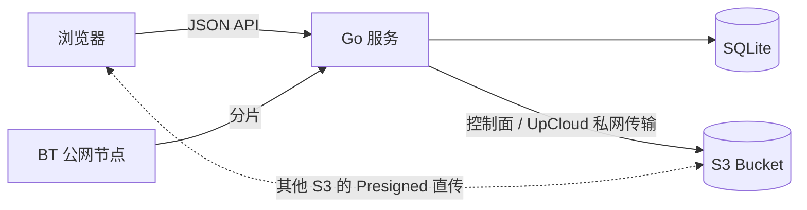

# revaro

revaro 是一个轻量、单用户、自托管的私人 S3 网盘，存储层采用 Seafile 式的**内容寻址块存储**：每个文件由 FastCDC 按内容切成可变大小的块，块以 SHA-256 内容寻址存入 S3，同一内容跨文件或跨版本只存一份；在文件中间插入内容也不会让后续所有块边界整体错位。块列表写入 JSON 清单（Seafile "fs object" 的等价物），SQLite 里的文件树只保存指向清单的键。Go 服务处理认证、SQLite 元数据和 S3 控制面；浏览器在 Worker 中分块、哈希，通常把块直传 S3；UpCloud endpoint 会自动改为经 Go 服务走私网转存，无需开放对象存储公网访问。UpCloud 下载也经 Go 服务转发；其他存储的单块文件仍走短期 Presigned URL 直连，多块文件由服务端流式拼接（支持 Range）。服务端还内置**磁力 / BitTorrent 离线下载**：校验完成的 BT 分片直接暂存到同一对象存储，任务可跨重启恢复，完成后按 FastCDC 导入网盘并立即停止上传，不继续做种。内置**阅读器**：EPUB/TXT 在服务端解析清洗，前端按章分段、按视口分栏分页，支持目录、滑动翻页、进度与字号/明暗偏好。音频和视频使用沉浸式播放器，并将播放进度同步到服务端。常见的 ZIP、7z、RAR 与压缩 TAR 文件可直接后台在线解压，导入完成前不会向文件树暴露半成品。内置**缩略图管线**：图片与 EPUB 封面由服务端重采样、视频由 ffmpeg 抽帧，持久化缓存。内置编辑器读写不超过 1 MiB 的文本文件时会经过应用服务，以便校验 UTF-8、大小和并发修改。

## 架构



- 用户路径与 S3 Object Key 完全解耦。文件内容以 `blocks/aa/<sha256>` 块对象存储，块列表以 `manifests/bb/<sha256>` 清单对象存储；同一内容（块级或整文件级）在 S3 中只存一份。清单的有序 block/size/offset 映射同时持久化到 SQLite，正常读取不访问 S3 清单；旧数据首次读取或启动 GC 扫描时会从原 JSON 清单自动回填。
- 多块读取依次经过全局 RAM LRU、本地 SSD 持久缓存和 S3。S3 返回的块必须同时通过 manifest 大小与 SHA-256 内容地址校验才会原子写入 SSD；相同块的并发 miss 合并为一个 S3 GET。普通读取预取 3 块，媒体、下载与解压按配置维持字节级 ahead 窗口，seek 会取消不再需要的旧窗口。
- 块对象使用 `If-None-Match: *` 条件写入，内容寻址对象不可变、不可被并发上传覆盖。
- 移动和重命名只更新 SQLite，不执行 `CopyObject`。
- 上传先写入 `pending` 元数据，浏览器按 FastCDC 的 min/avg/max 参数切块；默认用 Presigned URL 直传 S3，UpCloud 则自动经 revaro 转存到私网 endpoint。完成后服务端校验可变块列表的总大小并逐块 `HeadObject`，再写入清单并切换为 `ready`。旧的固定分块清单无需迁移，仍可正常读取。
- 删除会把文件或整棵目录树软删除到回收站；恢复前清单、块与缩略图仍是活引用。项目默认保留 30 天，过期后自动永久删除；手动永久删除、清空或到期清理产生的无引用内容由垃圾回收器安全释放。
- 升级前版本遗留的整对象会在启动时自动重新切块迁移，无法读取的遗留对象会标记为 `failed`。

## 快速开始（Docker / Podman）

仓库内的 Compose 配置默认拉取已发布的多架构镜像 `ghcr.io/vesperglow/revaro:latest`，同时启动 MinIO，并自动创建私有 Bucket 和开发用 CORS。

```bash
cp .env.example .env
# 至少修改 S3_SECRET_KEY；ADMIN_PASSWORD 留空会自动生成一次性密码
docker compose up -d
docker compose logs revaro
```

打开 <http://localhost:8080>。如果没有配置 `ADMIN_PASSWORD`，首次成功启动时会在 `revaro` 容器日志中打印一次管理员用户名和随机密码；登录后点击右上角头像进入账户设置并立即修改。MinIO 控制台位于 <http://localhost:9001>。

Podman 用户可以运行：

```bash
podman compose up -d
```

也可以直接拉取镜像：

```bash
docker pull ghcr.io/vesperglow/revaro:latest
```

每次 `main` 更新会发布 `latest` 和完整 commit SHA 标签；`v*` Git tag 还会发布对应版本标签。若 GHCR Package 尚未设为 Public，请先登录 GHCR，或在 GitHub Package 设置中将其改为公开。

生产环境应将 `APP_BASE_URL` 改为实际 HTTPS 地址（`COOKIE_SECURE` 会据此自动启用），使用高熵密码，并将 Bucket CORS 的来源改为同一个 HTTPS Origin。Compose 的 Web 管理端口默认只监听 `127.0.0.1`，应通过同机 HTTPS 反向代理对外提供服务；自带 MinIO 主要用于单机部署和本地体验，也可以删除 `minio` / `minio-init` 服务并指向已有 S3-compatible 存储。

内置 BT 默认额外公开宿主机 `51413/tcp` 与 `51413/udp`，以便接受入站节点连接；Web 管理端口仍只绑定 `127.0.0.1`。云防火墙需要放行对应的 TCP/UDP 端口。若不需要离线下载，设置 `BT_ENABLED=false`，并从 Compose 中移除这两条端口映射。

## 从源码构建

需要 Go 1.25+ 和 Node.js 24+。前端产物会写入 `internal/webui/dist` 并由 `go:embed` 打进二进制；该目录**不提交 git**（由 `npm run build` 生成本地副本），因此 clone 后必须先构建前端再运行 Go 构建或测试。

```bash
cd web
npm ci
npm run build
cd ..
go test ./...
go build -o revaro ./cmd/server
```

从当前源码构建容器并让 Compose 使用本地镜像：

```bash
docker build -t revaro:local .
REVARO_IMAGE=revaro:local docker compose up -d
```

运行：

```bash
set -a; . ./.env; set +a
./revaro
```

## 配置

| 变量 | 默认值 | 说明 |
|---|---:|---|
| `APP_ADDR` | `:8080` | HTTP 监听地址 |
| `APP_DATA_DIR` | `/data` | SQLite 数据目录 |
| `APP_BASE_URL` | `http://localhost:8080` | 用于同源写请求校验 |
| `COOKIE_SECURE` | 根据 Base URL | 生产必须为 `true`；HTTP 本地开发设为 `false` |
| `ADMIN_USERNAME` | `admin` | 首次初始化使用的管理员用户名 |
| `ADMIN_PASSWORD` | 随机生成 | 可选；设置时至少 12 字符，未设置时首次启动生成一次性密码；只保存 Argon2id hash |
| `S3_ENDPOINT` | AWS 默认 | S3-compatible endpoint；AWS S3 可留空 |
| `S3_PUBLIC_ENDPOINT` | 与 `S3_ENDPOINT` 相同 | 直连模式下浏览器可访问的签名 URL endpoint；代理模式无需公网 endpoint |
| `S3_REGION` | `us-east-1` | Bucket region |
| `S3_BUCKET` | 无 | Bucket 名称 |
| `S3_ACCESS_KEY` | 无 | 仅后端使用 |
| `S3_SECRET_KEY` | 无 | 仅后端使用 |
| `S3_PATH_STYLE` | `false` | MinIO 等存储通常设为 `true` |
| `S3_PROXY_TRANSFERS` | UpCloud 为 `true`，其他为 `false` | 上传与下载经 revaro 转发；可关闭对象存储公网访问并免配上传 CORS |
| `PRESIGN_EXPIRES` | `15m` | 上传、下载和预览 URL 有效期 |
| `BLOCK_SIZE` | `4194304` | FastCDC 目标平均块大小（字节），默认 4 MiB，范围 1 MiB–1 GiB |
| `FASTCDC_MIN_SIZE` | `BLOCK_SIZE / 4` | FastCDC 最小块大小，默认 1 MiB，范围 64 KiB–`BLOCK_SIZE` |
| `FASTCDC_MAX_SIZE` | `BLOCK_SIZE * 4` | FastCDC 强制切块上限，默认 16 MiB，范围 `BLOCK_SIZE`–1 GiB；代理传输模式最多 64 MiB |
| `BLOCK_RAM_CACHE_CAPACITY` | `268435456` | 全局 RAM block LRU 容量（默认 256 MiB）；`0` 禁用 |
| `BLOCK_SSD_CACHE_CAPACITY` | `8589934592` | `/data` 上持久 block LRU 最大容量（默认 8 GiB）；`0` 禁用 |
| `BLOCK_CACHE_MIN_FREE` | `2147483648` | SSD cache 写入后必须保留的文件系统可用空间（默认 2 GiB） |
| `BLOCK_CACHE_DIR` | `APP_DATA_DIR/block-cache` | SSD block cache 目录；应放在本地 SSD 持久卷 |
| `BLOCK_READ_AHEAD` | `67108864` | 连续读取的自适应预读上限；从 8 MiB 小窗口开始，持续顺序消费时逐步增长，seek/取消会重置；`0` 使用普通 2-block 预取 |
| `UPLOAD_EXPIRES` | `24h` | 未完成上传的清理期限，也决定垃圾回收宽限期下限 |
| `TRASH_RETENTION` | `720h` | 回收站保留期限（30 天）；到期后自动永久删除，`0` 表示禁用自动清理 |
| `GC_INTERVAL` | `1h` | 周期孤儿对象回收间隔；`0` 表示禁用周期扫描（回收站到期删除仍会触发一次回收） |
| `FFMPEG_PATH` | `ffmpeg` | 视频缩略图抽帧使用的 ffmpeg 可执行文件路径 |
| `BT_ENABLED` | `true` | 启用内置磁力 / `.torrent` 离线下载 |
| `BT_LISTEN_PORT` | `51413` | 容器内 BT TCP/UDP 监听端口；Compose 的宿主机端口由 `BT_PORT` 设置 |
| `BT_MAX_FILES` | `10000` | 单个种子允许的最大文件数 |
| `BT_MAX_TOTAL_SIZE` | `1099511627776` | 单个种子允许的最大总大小（默认 1 TiB） |
| `BT_METADATA_TIMEOUT` | `30m` | 磁力链接等待元数据的最长时间 |
| `BT_STALE_AFTER` | `48h` | 失败任务及其临时分片的保留时间 |

### UpCloud 私网模式

当 `S3_ENDPOINT` 的主机名以 `.upcloudobjects.com` 结尾时，revaro 会自动启用 UpCloud 兼容模式：AWS SDK 请求与响应校验切换为 `WHEN_REQUIRED`，文件块上传、下载和预览全部经 revaro 转发到 S3。对象存储可以只连接与 revaro VPS 相同的 SDN Private Network，并在 UpCloud 控制台保持 **Public access disabled**；`S3_PUBLIC_ENDPOINT` 和 Bucket CORS 都不再是必需项。

如需让浏览器恢复 Presigned URL 直传，可显式设置 `S3_PROXY_TRANSFERS=false`，同时启用 UpCloud Public access、配置 `S3_PUBLIC_ENDPOINT` 与下文的 Bucket CORS。

管理员设置只在数据库第一次初始化时读取。之后修改环境变量不会重置已有密码，避免部署配置漂移意外改密。随机密码只在新数据库首次成功启动时打印一次，不会在容器重启时再次显示；可通过右上角头像进入账户设置修改用户名和密码，修改后所有现有会话都会失效。

首次凭据会进入容器日志，任何能够读取日志的人都可能看到它。请在首次登录后立即修改密码，并限制部署平台与日志系统的访问权限；如果不希望凭据出现在日志中，请在首次启动前显式配置 `ADMIN_PASSWORD`。

如果已有数据库的管理员凭据丢失，不要删除数据卷。停止服务后运行一次恢复命令，它会保留文件与元数据、撤销已有会话，并在终端打印新的随机凭据：

```bash
docker compose stop revaro
docker compose run --rm --no-deps revaro reset-admin
docker compose start revaro
```

可在命令末尾指定新用户名，例如 `revaro reset-admin owner`。恢复密码同样只显示一次，登录后请立即从右上角账户设置中修改。账户设置也支持上传、更换和移除个人头像；头像文件保存在同一个私有 S3 Bucket 中，大小限制为 2 MiB。

## S3 权限

应用凭据只需操作指定 Bucket。AWS IAM 策略示例（替换 Bucket 名）：

```json
{
  "Version": "2012-10-17",
  "Statement": [
    {
      "Effect": "Allow",
      "Action": ["s3:ListBucket"],
      "Resource": ["arn:aws:s3:::my-private-revaro"]
    },
    {
      "Effect": "Allow",
      "Action": [
        "s3:GetObject",
        "s3:PutObject",
        "s3:DeleteObject"
      ],
      "Resource": ["arn:aws:s3:::my-private-revaro/*"]
    }
  ]
}
```

Bucket 必须保持私有。直连模式的浏览器访问依赖 Presigned URL，而不是公开读取权限；UpCloud 代理模式可同时关闭整个对象存储的 Public access。

## Bucket CORS

仅在 `S3_PROXY_TRANSFERS=false` 时，浏览器会直接 PUT/GET S3 块对象，因此必须配置 CORS。UpCloud endpoint 默认启用代理传输，不需要开放公网 endpoint 或为上传配置 Bucket CORS。其他存储的生产环境不要使用 `AllowedOrigins: ["*"]`，应只允许网盘 Origin：

```json
[
  {
    "AllowedOrigins": ["https://drive.example.com"],
    "AllowedMethods": ["GET", "HEAD", "PUT"],
    "AllowedHeaders": ["*"],
    "MaxAgeSeconds": 3600
  }
]
```

`AllowedHeaders` 必须覆盖 `If-None-Match`。块上传的 Presigned URL 会把条件写入绑定为签名头，并把块 SHA-256 绑定为签名查询参数；浏览器无需再发送额外的校验和请求头。若块已存在，S3 返回 `412 Precondition Failed`，前端把它视为“内容相同的块已存在”并继续——这正是内容寻址去重的正常路径。不再需要 `ExposeHeaders: ["ETag"]`。

## API

除健康检查和登录外，所有 API 都要求 `HttpOnly` Session Cookie。

| 方法 | 路径 | 用途 |
|---|---|---|
| `GET` | `/healthz`、`/readyz` | 存活与 SQLite 就绪检查 |
| `POST` | `/api/auth/login`、`/api/auth/logout` | 登录与注销 |
| `GET` | `/api/auth/me` | 当前管理员 |
| `GET` / `PUT` / `DELETE` | `/api/profile/avatar` | 读取、更新或移除个人头像 |
| `GET` | `/api/storage/stats` | 所有 ready 文件的逻辑总大小与文件数 |
| `GET` | `/api/files/{id}` | 文件/目录与面包屑 |
| `GET` | `/api/files/{id}/children` | 目录内容 |
| `POST` | `/api/directories` | 新建目录 |
| `PATCH` | `/api/files/{id}` | 重命名、移动或同时执行 |
| `DELETE` | `/api/files/{id}` | 把文件或目录树移入回收站 |
| `GET` | `/api/trash` | 列出回收站根项目 |
| `POST` | `/api/trash/{id}/restore` | 恢复项目到原位置（原目录不存在时回到根目录） |
| `DELETE` | `/api/trash/{id}` | 永久删除回收站项目 |
| `DELETE` | `/api/trash` | 清空回收站 |
| `GET` | `/api/files/{id}/download` | 302 到 Presigned 下载 URL |
| `GET` | `/api/files/{id}/preview` | 302 到图片预览 URL |
| `GET` / `PUT` | `/api/files/{id}/content` | 读取或保存可编辑文本文件，含 ETag 冲突保护 |
| `GET` | `/api/files/{id}/book` | 阅读器元数据：格式、标题、封面与目录 |
| `GET` | `/api/files/{id}/book/content` | EPUB 清洗后的正文 HTML 或 TXT 全文与目录 |
| `GET` | `/api/files/{id}/book/assets/{n}` | EPUB 内嵌图片 |
| `GET` | `/api/files/{id}/book/cover` | EPUB 内嵌封面 |
| `GET` / `PUT` | `/api/files/{id}/book/progress` | 阅读进度（页数与总页数） |
| `GET` | `/api/files/{id}/thumbnail` | 持久化缩略图（图片/EPUB 封面服务端生成、视频 ffmpeg 抽帧，不可变缓存） |
| `PUT` | `/api/files/{id}/thumbnail` | 上传前端抽帧的 JPEG 缩略图（无 ffmpeg 部署的兜底） |
| `POST` | `/api/documents` | 在指定目录新建 UTF-8 文本文档 |
| `GET` / `POST` / `DELETE` | `/api/files/{id}/share` | 查询、创建/重置或停止公开分享 |
| `GET` | `/s/{token}` | 无需登录，通过稳定分享地址读取文件 |
| `POST` | `/api/uploads` | 创建块上传，返回块大小与块数 |
| `POST` | `/api/uploads/{id}/blocks` | 登记内容块（每批最多 1000 个），为缺失块签发条件 Presigned PUT |
| `POST` | `/api/uploads/{id}/complete` | 服务端逐块 `HeadObject` 校验、写入清单并切换为 `ready`；缺失块返回 `409 + missing_blocks` 供前端修复重试 |
| `DELETE` | `/api/uploads/{id}` | 取消并清理待上传元数据 |
| `POST` | `/api/audio-merges` | 按给定顺序和可选封面创建后台音频合并任务，可选 FLAC、ALAC 或 AAC |
| `GET` | `/api/audio-merges` | 查询当前进程中的全部后台音频合并任务 |
| `GET` / `DELETE` | `/api/audio-merges/{id}` | 查询进度、取消任务或清除已完成记录 |
| `GET` | `/api/files/{id}/audio` | 获取合并音频的章节、封面和流式播放信息 |
| `GET` | `/api/files/{id}/audio/stream` | 支持 HTTP Range 的浏览器兼容音频流 |
| `GET` | `/api/files/{id}/video` | 获取与视频同名的外挂字幕轨 |
| `GET` | `/api/files/{id}/video/subtitles/{subtitle}` | 把 VTT/SRT/ASS/SSA 字幕作为 WebVTT 返回 |
| `POST` | `/api/files/{id}/video/fmp4` | 创建不重新编码音视频的临时 fragmented MP4 remux 会话 |
| `GET` | `/api/video/fmp4/{session}/stream` | 把 FFmpeg stream-copy 产生的 fragmented MP4 stdout 直接流式送入 MSE |
| `DELETE` | `/api/video/fmp4/{session}` | 停止会话并取消 FFmpeg、源 Range 请求及后续块读取 |
| `POST` | `/api/files/{id}/video/hls` | 为浏览器不兼容的视频启动按需 FFmpeg HLS 流 |
| `GET` / `PUT` | `/api/files/{id}/media/progress` | 读取或保存音频/视频的跨设备播放进度 |
| `POST` | `/api/files/{id}/extract` | 创建安全检查后后台执行的在线解压任务 |
| `GET` | `/api/archive-jobs/{id}` | 查询在线解压状态与生成的目录 |
| `POST` / `GET` | `/api/downloads` | 创建磁力、`.torrent` 或 HTTP(S) 直链离线下载、列出任务 |
| `GET` / `DELETE` | `/api/downloads/{id}` | 获取文件列表与进度、删除任务及临时分片 |
| `POST` | `/api/downloads/{id}/start` | 选择种子内文件并开始下载 |
| `POST` | `/api/downloads/{id}/pause`、`/resume` | 暂停或继续下载 |

## 内置磁力与 BT 下载

顶部“离线下载”中心接受 `magnet:` 链接、最大 4 MiB 的 `.torrent` 文件以及普通 HTTP(S) 文件直链。创建时可以从整棵目录树选择保存位置，元数据就绪后再逐项勾选种子内文件；任务分别显示下载和 FastCDC 导入阶段的字节进度与速度，支持暂停、继续及删除。直链由服务端流式写入内容寻址对象，不要求 VPS 本地磁盘容纳完整文件；出于 SSRF 防护，链接、DNS 解析和每次重定向都只允许公网目标。多文件种子会以种子名称创建根目录，内部相对路径保持不变；单文件种子与直链直接进入所选目录。同名项目不会被覆盖，导入会失败并保留错误记录。

未校验的数据只写入 `APP_DATA_DIR/torrent-cache` 的有界临时缓存；每个通过 BT piece hash 校验的分片会作为 `bt-temp/<infohash>/<piece>` 对象写入 S3，并在 SQLite 中建立索引。服务重启后会从这些对象继续，不要求本地磁盘容纳整份下载。全部选中文件完成后，服务端从已校验分片流式读取，走普通 FastCDC 内容寻址管线生成 `blocks/` 与 `manifests/`，原子写入文件树，随后删除 `bt-temp/` 分片并从 swarm 退出。这里没有完成后的做种模式。

为了防止恶意种子把服务当作内网探测器，BT 节点、HTTP Tracker 与 WebSeed 的私有、回环、链路本地、CGNAT 和保留地址都会被拒绝。离线下载仍会访问公网第三方节点，部署者应遵守所在地法律和内容授权要求；应用不会绕过 Tracker、站点或内容本身的访问控制。

## 公开分享

文件操作区的“分享”按钮可以创建一个高熵公开链接。链接长期有效，任何持有者无需登录即可访问；重新生成链接会立即废弃旧地址，“停止分享”会撤销当前地址。文件进入回收站后分享立即不可访问，恢复后重新生效；永久删除会同时删除分享记录。

公开入口对单块文件每次签发一个短期 S3 URL 并返回 302，多块文件则由应用服务按清单流式拼接（支持 Range），并按文件扩展名返回适合的内容类型。分享地址是稳定的原始文件读取地址，因此也能用于任何支持 HTTP URL 的客户端。每次分享访问都会写入服务日志（token 只记录前 8 位前缀），便于泄露后定位访问来源。

分享 URL 等同于访问凭据，请不要发布到公开仓库、聊天群或日志中。若怀疑泄露，请立即重新生成或停止分享。

## 内置阅读器

点击 `.epub` 文件（或超过 1 MiB 的 `.txt` 文件）即可在网盘里直接阅读，也可以随时用文件操作区的“阅读”按钮打开；`/read/{file_id}` 深链可直接进入某本书。阅读逻辑**原样移植自 [VesperGlow/reader](https://github.com/VesperGlow/reader)**（前端直接复用其 reader.js 与样式，仅把 API 接到网盘），去掉了它独立的账号/书架/上传，复用本服务的认证、文件树与 S3 块存储：

- **服务端解析**：EPUB 解包、OPF/spine、目录（EPUB3 nav + NCX 回退）、封面与系列元数据抽取全部在 Go 服务端完成；正文按白名单重建 HTML（脚本、事件处理器、`javascript:` 等危险内容按构造不会出现），内嵌图片改写为带内容版本参数的 `/api/files/{id}/book/assets/{n}?v=…` 分发（不可变，可长期缓存）。解析对解压总量设硬上限（256 MiB），恶意的高压缩比 EPUB（zip bomb）会被拒绝而不是耗尽内存。TXT 自动识别 UTF-8/GBK 编码，并按“第…章”式标题生成目录。
- **解析缓存**：解析结果按文件的内容哈希（清单键）缓存，最近 3 本 keep-alive；内容寻址保证缓存永不陈旧，同一本书再次打开零解析。
- **分段分栏分页**：每章一个分栏段（每栏=一屏），翻页只滑动当前章的小层，跨章瞬时切换；桌面点击左右热区、键盘方向键/PageUp/PageDown/空格翻页，移动端左右滑动跟手翻页（快速轻扫或拖过 1/4 屏判定）。
- **进度与偏好**：阅读进度按百分比防抖保存（`/api/files/{id}/book/progress`），另有 15 秒心跳与失焦保存；字号（14–32px）与明暗主题独立记忆，重排时按比例回到对应位置。
- 上限：EPUB 128 MiB、TXT 16 MiB；更大的文件请下载后离线阅读。

## 文档编辑器点击 `.md`、`.markdown`、`.txt`、`.yaml`、`.yml`、`.json`、`.toml`、`.ini`、`.conf`、`.log` 或 `.csv` 文件即可打开编辑器；当前目录也可以直接新建文档。Markdown 支持编辑、分栏和安全过滤后的预览，`Ctrl/⌘ + S` 可保存。

编辑器只接受 UTF-8 且不超过 1 MiB 的文件。保存会把新内容切块并写入新的清单对象，再更新 SQLite 中的大小、MIME 与 ETag——ETag 即清单的 SHA-256 内容哈希，天然代表内容版本；若文件已被其他页面修改，旧编辑会收到 `409 Conflict`，不会静默覆盖新内容。旧清单与旧块由垃圾回收器回收。已有公开分享链接无需重建，会读取保存后的最新内容。

## 媒体预览

当前目录中的图片、GIF 和视频会组成一个循环媒体序列。桌面端使用收敛后的左右按钮或键盘方向键切换；移动端不显示翻页按钮，直接左右滑动。图片支持滚轮、双击、按钮与双指手势缩放，放大后可拖动查看。视频使用画面内叠层控件与自动隐藏的进度、音量、字幕、全屏控制，并把持久化视频缩略图作为播放封面。浏览器原生支持的视频仍优先走 Range 直放；MKV 等容器会先由 FFmpeg 以 `-c copy` 重封装为 fragmented MP4，再通过 MSE 交给浏览器/GPU 解码，HEVC 不会在这条路径中转成 H.264。前端同时检查 MSE MIME 支持和 Media Capabilities；编码、音频或移动端硬解不兼容，以及 MSE 追加/解码失败时，会携带明确原因自动回退到原有 HLS。HLS session cache、相近起点复用与独立字幕缓存继续保留，完整进度条可跨尚未生成的区间重新起流跳转。音频文件会打开独立播放器。预览弹窗点击媒体周围的空白区域即可关闭，底部下载按钮始终下载原始文件。

文件网格与列表为图片、视频和 EPUB 提供**持久化缩略图**：图片与 EPUB 封面由服务端重采样（480px，JPEG），视频由内置 ffmpeg 在 1 秒处通过 FastCDC Range 源抽帧，不再需要先把多 GB 视频完整落到 VPS；缩略图作为内容寻址派生对象存在 S3 的 `thumbs/` 前缀，经内容哈希版本化的不可变 URL 由浏览器长期缓存。视频抽帧同时最多一个 ffmpeg 任务；无 ffmpeg 的部署回退为浏览器抽帧上传。图片缩略图生成有像素尺寸上限（40 MP / 单边 30000px）和并发上限，防止高压缩比图片在解码时耗尽内存；浏览器上传的 JPEG 也会由服务端重新解码、缩放和编码后再保存。

单块媒体（默认 4 MiB 以下）仍直连 S3；多块媒体由服务端按清单流式拼接，下载与预览端点支持 HTTP Range，视频拖动进度条会按需抓取对应块。

应用识别 JPEG、PNG、WebP、GIF、AVIF，以及 MP4、WebM、OGV、MOV、M4V、MKV、AVI、FLV、WMV、MPG/MPEG、TS/M2TS/MTS、MP3、WAV、OGG、M4A、AAC、FLAC、Opus、WMA、AIFF、APE 等常见扩展名。视频会自动匹配同目录及两层 `Subs`/`Subtitles` 子目录中同基名或带语言后缀的 `.vtt`、`.srt`、`.ass`、`.ssa`，转换为浏览器可选的 WebVTT 字幕轨；原始视频与字幕文件不会被改写。

### 音频合并

同时选中 2–256 个音频文件后，文件操作栏会出现“合并音频”。弹窗左侧集中设置输出格式、文件名和可选封面，右侧用上下箭头确认播放顺序，并在每段音频下方显示同目录、同基名 `.vtt` 字幕的匹配状态。界面会优先列出当前目录中的 JPG、PNG、GIF、WebP 等图片并预选最像封面的文件，也可改选其他目录图片或从设备上传。可选择默认 FLAC（无损 `.flac`）、ALAC（无损 `.m4a`，适合 Apple 生态）或 192 kbps AAC（有损 `.m4a`，体积更小）。服务端从 S3 分块存储流式准备源文件，按输入中的最高采样率和最大声道布局统一音频参数，不会像旧实现一样固定降为 48 kHz 立体声；随后交给 FFmpeg 编码，再按 FastCDC 写回当前目录。每个源文件名都会持久化为一个章节标题，封面会嵌入最终成品并用于播放器展示；ALAC/AAC 输出还会把匹配的 WebVTT 按累计音频时长校准后合并为 `mov_text` 字幕轨。FLAC 不支持内嵌字幕，界面会保留匹配提示但不会打包字幕。

合并结果使用分节播放器：上半区左侧显示封面和当前分节，右侧同步显示字幕并可切换章节列表，下半区集中放置进度和播放控制；支持上一节/下一节跳转、前后快进、倍速播放，并自动保存上次播放位置。播放器通过 HTTP Range 直接读取合并后的原始 FLAC 或 ALAC `.m4a`，只请求起播或跳转所需的字节，不生成 AAC 播放副本，也无需先下载完整的数小时文件。ALAC 能否播放取决于访问浏览器自身的解码支持。

FLAC 与 ALAC 都使用真正的无损编码；自动化测试会把同规格 WAV 源和合并结果分别解码成 32-bit PCM 并逐字节比较，确保合并前后完全一致。不同采样率或声道布局的源文件为了组成单一连续音轨仍需统一参数；MP3、AAC 等有损源转成 FLAC/ALAC 只能避免再次有损压缩，无法恢复源文件此前已经丢失的信息。

点击“开始合并”后任务会立刻进入后台队列并关闭设置弹窗，不影响继续浏览、上传或创建下一项合并。顶部音频任务中心集中展示全部队列、实时进度和完成状态，并可取消或清除记录。服务器允许两个合并同时执行，其余任务保持排队；每项最多运行 24 小时。准备阶段和输出阶段会在 `APP_DATA_DIR` 使用临时空间，成功、失败或取消后立即清理。容器重启会清理已中断任务留下的 `pending` 占位文件，原始音频始终保持不变。

侧栏显示所有 `ready` 文件的逻辑总大小与文件数。它不代表对象存储供应商的计费占用，不计未引用的待回收块、Bucket 版本历史或供应商额外开销；去重后实际占用通常会低于逻辑总量。

## 块存储与对象布局

界面中的目录、显示名和层级保存在 SQLite。存储层采用 Seafile 式的三层内容寻址：

- **块（block）**：文件内容按 `BLOCK_SIZE`（默认 4 MiB）切块，每块以 `blocks/<前2位>/<其余62位>` 的 SHA-256 内容地址存入 S3。相同内容只存一份，块对象不可变（条件写入保护）。
- **清单（manifest）**：每个文件的块列表序列化为 JSON，以清单自身的 SHA-256 为键存入 `manifests/…`。`files.object_key` 指向清单，`files.etag` 即清单哈希，天然是内容版本的指纹。
- **文件树（SQLite）**：名称、目录关系、大小、MIME 与清单键；移动/重命名零 S3 操作。

上传流程：浏览器把文件切成块 → 逐块算 SHA-256 → 批量登记，服务端对已存在的块返回 `exists:true`（去重跳过）。直连模式会为缺失块签发同时绑定 `If-None-Match: *` 签名头与 SHA-256 签名查询参数的 Presigned PUT；UpCloud 代理模式则返回同源上传 URL，由 revaro 校验块哈希后写入私网 S3。完成后服务端 `HeadObject` 逐块校验、写入清单并把文件切换为 `ready`。极端竞态下（登记后某块被 GC 回收）完成接口返回 `409 + missing_blocks`，前端自动补传重试。

下载流程：单块文件（绝大多数图片、文档、短视频）302 到 Presigned GET 直连 S3；多块文件由服务端按清单流式拼接，`ServeContent` 提供 Range/If-Modified-Since 支持。回收站保留元数据、清单、块与缩略图引用；永久删除后，垃圾回收器才会在宽限期后按引用关系回收内容，并同时清理失去引用的 `thumbs/` 缓存和升级前的 `objects/` 遗留对象。

## 数据模型与一致性

- `files`：文件树、显示名、清单键（`object_key`）、大小、MIME、ETag（清单哈希）、状态与软删除/恢复位置；固定 root ID 为 `00000000-0000-0000-0000-000000000000`。`pending` 上传行在完成前 `object_key` 为空。
- `uploads`：块上传控制状态、块大小、预期大小与过期时间。
- `shares`：文件与高熵公开 token 的一对一映射。
- `sessions`：只保存 Session Token 的 SHA-256 hash，不保存明文 Token。
- `settings`：管理员用户名、Argon2id 密码 hash 和头像媒体类型；头像内容以普通对象保存在 S3。

SQLite 开启 `foreign_keys`、`busy_timeout` 与 WAL。文件名唯一性由数据库索引保证；目录移动通过 recursive CTE 阻止自环和移动到子孙目录。

启动时及之后每 15 分钟扫描过期上传和回收站：`deleted_at` 超过 `TRASH_RETENTION`（默认 30 天）的整棵回收站目录树会在一个 SQLite 事务中永久删除，并立即请求一次对象垃圾回收；即使 `GC_INTERVAL=0`，到期清理产生的内容也会释放。周期 GC 默认每小时运行，收集无引用的清单、块、缩略图和旧版整对象，宽限期为 `UPLOAD_EXPIRES + 1h`，保证进行中上传的块（自身即"无引用"状态）绝不会被提前回收。应用崩溃无法提供跨 SQLite/S3 的分布式事务；失败状态会保留元数据以避免静默丢失，孤儿对象由回收器兜底。

## 备份与恢复

文件内容位于 S3，但文件树、名称和目录关系只在 SQLite，**必须同时备份 SQLite 与 S3 Bucket**。

最简单且安全的停机备份：

```bash
docker compose stop revaro
docker run --rm -v revaro_revaro-data:/data -v "$PWD/backups:/backup" alpine \
  cp /data/revaro.db /backup/revaro-$(date +%F).db
docker compose start revaro
```

不停机备份应使用 SQLite Online Backup API 或 `sqlite3 /data/revaro.db ".backup '/backup/revaro.db'"`，不要只复制运行中的 WAL 主文件。恢复时先停止 revaro，用备份替换 `/data/revaro.db`，确认文件属主可由容器 UID `10001` 读取，再启动服务。S3 对象也必须来自相互匹配的备份时间点。

## 安全设计

- Argon2id 密码 hash（随机盐），`crypto/rand` 生成高熵 Session；数据库只保存 Session hash。
- `HttpOnly`、`SameSite=Lax` Cookie；生产 HTTPS 下强制 `Secure`。
- 写请求必须携带与 `APP_BASE_URL` 匹配的 Origin（无 Origin 的写请求直接拒绝），JSON body 上限、文件名/长度校验、参数化 SQL、登录内存限速。
- Presigned URL 短期有效；日志不记录密码、Cookie、S3 Secret 或完整 Presigned URL。
- 完成上传不信任浏览器状态，必须由后端 `HeadObject` 逐块校验存在性与大小，再写入清单；过期上传（超过 `UPLOAD_EXPIRES`）在窗口期内也无法完成。
- 垃圾回收对**被引用**清单的读取失败会中止本轮回收，绝不在清单内容未知时删除任何块；未被引用的清单无需解析即可回收，减少 GC 的 S3 读取量。
- 容器以非 root UID `10001` 运行。

## 当前限制

- 单用户模型：一个管理员账户、一棵文件树，没有注册与多用户。
- 非空目录会在单个 SQLite 事务中整棵移入回收站；恢复与永久删除同样是原子操作，重名恢复返回 `409`，不会覆盖现有项目。
- MSE fMP4 是 `-c copy` 的 stdout 真流式 remux，不创建临时 window 文件；seek 会取消旧会话并从目标时间启动新流，同一时间最多两个 remux。回退的视频兼容播放仍是单实例、最多一路的临时 FFmpeg HLS，不生成持久播放副本；只有进入 HLS 的 HEVC 等格式才可能消耗实时转码 CPU。无波形、OCR 或 EXIF 索引。单文件上限 1 TiB，清单最多 262144 块；超大文件的逐块校验开销随块数线性增长。
- 登录限速与公开分享并发限制是单实例内存状态；这符合单实例部署模型。
- 块上传不做跨浏览器断点恢复；取消或过期会清理元数据，孤儿块由回收器回收，网络失败可在当前页面重试。
- 回收站项目仍占用对象存储空间；永久删除后内容对象进入异步垃圾回收，直到下一次宽限期后的回收才释放空间。
- 阅读器不解析 PDF/MOBI；EPUB 上限 128 MiB、TXT 上限 16 MiB，且解析缓存为单实例内存（最多 3 本）。
- 视频缩略图、兼容播放、字幕转换和音频合并依赖容器内置的 ffmpeg/ffprobe（可用 `FFMPEG_PATH` 指定）。
- BT 目前支持 BitTorrent v1/兼容磁力任务的下载与选文件，不提供完成后做种、RSS、Tracker 登录或远程下载规则；边界 piece 可能包含未选文件的少量相邻数据，这是 BT 分片模型的正常现象。

## 测试

```bash
cd web && npm ci && npm run build && npm run lint && cd ..
go test ./...
go vet ./...
go build ./...
docker build -t revaro:test .
```

前端有 ESLint（`npm run lint`）与 `vue-tsc` 类型检查（构建时自动执行）。测试覆盖登录、Session、Session 过期、密码盐、头像生命周期、媒体预览与空间统计、文本编辑（含过期 ETag 保存冲突 409）、公开分享（单块跳转与多块流式 Range）、回收站（目录树软删除、分享隔离、恢复、重名冲突、永久删除、清空、30 天到期清理与 GC 引用保护）、同目录名称冲突、root 保护、目录循环、写请求 Origin 校验（无 Origin / 跨源拒绝）、未知 API 路径返回 JSON 404、过期上传无法完成、块上传 `pending → ready`、块登记、缺失块修复响应、音频合并（WAV/MP3 混合输入、FLAC/ALAC/AAC 实际编码、无损 PCM 逐字节验证、同目录封面嵌入、持久化章节、原始成品 Range 播放、多后台任务与中断占位清理）、布局校验、多块下载 Range、去重共享、空文件、垃圾回收（含缩略图与音频封面回收保护、共享引用保护、被引用清单读取失败时中止回收）、遗留对象迁移、缩略图（图片重采样与缓存头、EPUB 封面、视频上传/命中/非法拒绝、ffmpeg 抽帧）、阅读器（EPUB 解包/目录/白名单清洗/图片重写/解压炸弹拒绝、TXT 编码与章节偏移、进度存取、接口鉴权），以及 config（默认值/覆盖/校验）、ids（UUID 格式）、database（迁移幂等、WAL、外键）、webui（SPA 回退、路径穿越）单元测试。GitHub Actions 会对每次 push / PR 重复执行这些检查。
