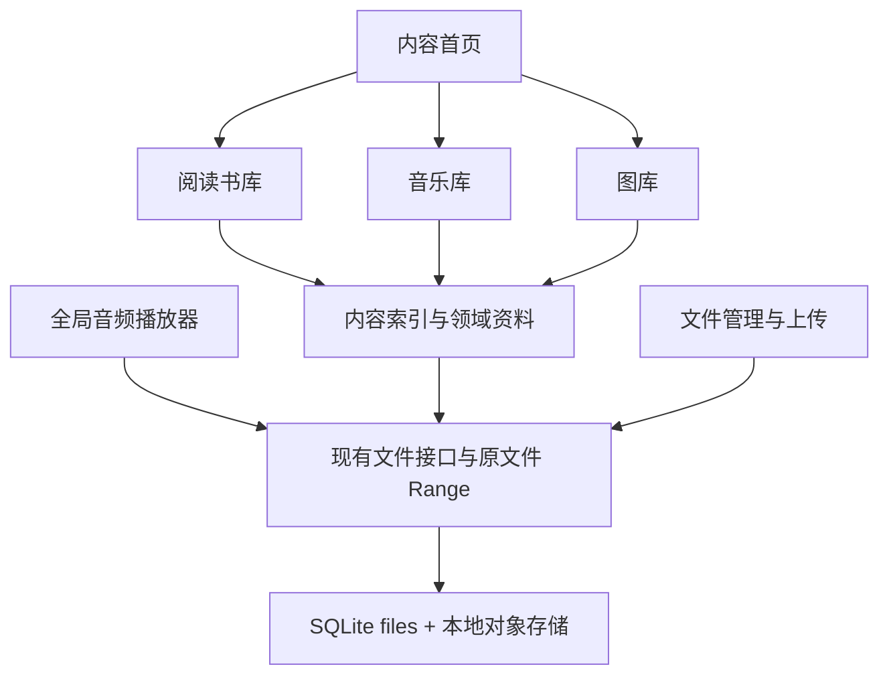

# Revaro 阅读、音乐、图库三合一改造方案

状态：第一版已实现并提供独立本地预览；本文保留完整改造方向，实施范围见 [第一版说明](content-library-preview.md)。基于当前 Rust workspace、数据库迁移、主要前端组件、文件生命周期、阅读与媒体接口、项目文档和现有 E2E 用例审阅。

## 1. 推荐方向

把 Revaro 定位为自托管的个人内容库：阅读、音乐、图库成为主要入口，文件管理承担上传、整理、下载和恢复的基础职责。

同一个文件只保留一份原始内容。书架、歌单、相册通过文件 ID 建立关系，不要求把旧文件移动到三个指定目录，也不为每个内容库再上传一份副本。用户可以一边阅读或看图，一边播放音乐。

沿用 Rust、Axum、Leptos CSR、SQLite 和本地对象存储。现有阅读与媒体引擎适合继续使用；主要新增工作是应用壳、内容索引、领域元数据和全局播放状态。

## 2. 当前项目具备什么、缺什么

| 部分 | 已有能力 | 改造缺口 |
|---|---|---|
| 应用入口 | 登录后直接挂载 `FileBrowser`，顶栏、文件夹导航、上传、任务、账户功能齐全 | 独立的首页、书库、音乐库、图库与页面路由 |
| 阅读 | EPUB/TXT 解析、封面、目录、CSS columns 分页、字号/行距、明暗主题、锚点进度、阅读缓存 | 可查询的书籍资料、阅读状态、书架；书签和批注也尚未形成产品能力 |
| 音频 | 原文件 Range 播放、内嵌封面、章节、倍速、音量、进度同步 | 歌曲/歌手/专辑资料、歌单、播放队列、跨页面持续播放 |
| 图片 | 缩略图、放大/拖动、触摸操作、前后切换、缩略图条 | 全局图库、相册、图片资料、日期分组与跨分页浏览 |
| 数据 | `files`、`media_metadata`、`media_progress`、`settings`、任务、分享、版本历史 | 内容分类索引、领域元数据、集合关系和使用状态 |
| 运行 | 单进程媒体/阅读并发限制、持久任务记录、SSE 通知、备份恢复、对象清理 | 可恢复的批量内容索引工作器、派生结果版本校验 |

需要特别处理的现状：

1. `FileBrowser` 约 2,961 行，同时管理导航、上传、账户、阅读、预览和文件操作。新页面不宜继续堆进这个组件。
2. `AudioPlayer` 属于预览窗口；组件卸载时保存进度、暂停、清空音源。要实现边看边听，必须调整播放器归属。
3. FFmpeg 探测模型主要保存时长、编码、尺寸和章节，没有歌曲标题、歌手、专辑等音乐标签。EPUB 模型已有标题和封面，但没有作者等完整书籍资料。
4. `/api/files` 支持目录/全局文件名搜索和分页，目前没有内容类别过滤。不能只过滤前端已经加载的 100 条文件来实现全局书库或图库。
5. 图片前后切换依赖传入的已加载文件数组。独立图库需要依据完整查询顺序继续加载，不能在第一页末尾直接回到第一张。
6. 阅读进度写入 `settings` 的 `book_progress/{file_id}` 键；能恢复位置，但不适合作为长期的阅读状态与历史查询模型。
7. 普通小 TXT 当前默认进入编辑器；书库里的 TXT 应明确进入阅读器，文件页继续提供编辑操作。
8. 当前是单管理员产品，没有独立用户表和每用户内容权限。第一阶段按现有账户模型设计；多人独立书架/歌单需要另立范围。

主要依据：

- [应用入口](../crates/revaro-web/src/app.rs)、[文件浏览器](../crates/revaro-web/src/components/file_browser.rs)、[路由逻辑](../crates/revaro-web/src/logic/routing.rs)
- [音频播放器](../crates/revaro-web/src/components/audio.rs)、[媒体预览](../crates/revaro-web/src/components/media.rs)、[媒体探测](../crates/revaro-media/src/probe.rs)
- [阅读模型](../crates/revaro-reader/src/model.rs)、[阅读接口](../crates/revaro-server/src/reader_routes.rs)、[阅读器架构](reader-flow.md)
- [文件查询](../crates/revaro-server/src/listing_routes.rs)、[初始数据库](../crates/revaro-server/migrations/001_local_product.sql)、[媒体模型](../crates/revaro-core/src/media.rs)
- [任务中心](../crates/revaro-web/src/components/tasks.rs)、[上传完成流程](../crates/revaro-server/src/upload_routes.rs)、[存储与运行边界](data-plane.md)

## 3. 应用导航与页面形态

建议延续现有全宽、简洁的布局，用顶部主导航形成清晰的内容入口。

```text
Revaro   首页  阅读  音乐  图库                   搜索  导入  任务  账户
──────────────────────────────────────────────────────────────────
页面标题、当前内容库的分类/筛选与操作

首页：继续阅读 → 最近播放 → 最近添加的图片/相册
阅读：竖向书封 + 书名/作者 + 阅读进度
音乐：专辑封面网格 / 歌曲列表 / 歌单
图库：按日期分组的图片墙 / 相册

──────────────────────────────────────────────────────────────────
有播放会话时显示：封面  歌曲/歌手   上一首  播放  下一首  进度  队列
```

文件管理、回收站、分享管理归入工具入口，文件管理仍有直接路由可访问。这样首页首先呈现用户可以继续使用的内容。

移动端使用底部「首页 / 阅读 / 音乐 / 图库」导航；文件管理放在账户/工具菜单。迷你播放器位于底部导航上方，内容区域预留其高度与安全区。阅读器全屏时收起主导航，音乐继续播放，提供紧凑的播放控制入口。

三个内容库保持同一套字体、间距、按钮和中性色，但采用适合内容的布局：书封偏竖向、专辑封面偏方形、图库保留图片比例。文件页维持现有整理操作；不把同一套方块文件卡片机械地复制到三个页面。

推荐路径：

| 路径 | 页面 |
|---|---|
| `/` | 内容首页 |
| `/library` | 阅读书库 |
| `/read/{id}` | 阅读器，沿用现有路径 |
| `/music` | 音乐库 |
| `/music/albums/{id}`、`/music/playlists/{id}` | 专辑与歌单详情 |
| `/gallery`、`/gallery/albums/{id}` | 图库与相册详情 |
| `/files` | 文件管理根目录 |
| `/f/{id}` | 原有文件夹深链 |

路由状态由应用壳管理，页面只管理自己的筛选、滚动与选择状态。保留现有文件夹和阅读深链；原来代表文件根目录的 `/` 改为首页，文件根目录的 URL 生成逻辑同步调整。阅读/看图返回原入口，并恢复筛选与滚动位置；刷新与浏览器前进后退必须能够恢复页面。

## 4. 三个内容库的核心体验

### 阅读

- 默认展示「继续阅读」和「全部书籍」，支持未读、在读、已读筛选。
- 书卡显示封面、书名、作者、进度；点击进入现有阅读器。
- 用户可创建书架，同一本书可以加入多个书架。
- 优先从 EPUB 元数据提取标题、作者、语言等；TXT 默认使用文件名，允许手工修改展示资料。
- TXT 自动识别为候选内容，但支持排除日志、配置说明等文件；库的来源目录可配置。
- 书签可沿用稳定锚点；划线和批注涉及范围锚点及重排，放在核心书库稳定之后。

第一阶段沿用 EPUB/TXT。PDF 等格式需要独立渲染与定位机制，不能只扩充后缀名单就视为已支持。

### 音乐

- 默认以「歌曲」作为可靠入口，有标签的内容再聚合为「专辑 / 歌手」。
- 提取标题、歌手、专辑、专辑艺术家、曲序、碟序与时长；资料缺失时使用文件名和明确的未知项。
- 专辑聚合不能只使用专辑名称：至少结合专辑艺术家，必要时让用户手工拆分或合并。
- 支持歌单、当前播放队列、上一首/下一首、顺序/随机/单曲循环、收藏。
- 点击歌曲立即播放；退出播放详情、进入书库或图库时，音频元素继续存在。
- 音乐通常从头播放；有声书/长音频继续使用进度恢复和章节能力，可标记为「长音频」，避免所有歌曲都强制续播到中途。
- 刷新后恢复队列与位置，但实际开始播放遵循浏览器限制，由用户点击触发。

浏览器继续解码原始音频。被识别为音频与当前浏览器能播放是两回事；解码失败应给出清晰状态，队列推进需有次数上限，避免错误循环。系统媒体控制、锁屏控制可做渐进增强，其支持情况需在实施时核验并用目标设备验证。

### 图库

- 提供「全部图片 / 相册 / 收藏」；先覆盖照片、插画、截图和壁纸等通用图片。
- 使用保留比例的图片墙，图片成为视觉主体，文件名和操作在需要时出现。
- 支持按拍摄时间或添加时间分组；拍摄时间缺失时使用添加时间，并明确日期来源。
- 保存图片尺寸、方向、可用的 EXIF 时间；时间缺少时区时保留原始信息，不任意解释为 UTC。
- 人工相册通过关联记录组成，一张图片可加入多个相册；文件夹作为另一个浏览筛选维度，不与相册绑定。
- 复用现有图片查看器的缩放、拖动、触摸与缩略图条，补充资料面板及跨分页前后切换。
- 当前分类覆盖 JPEG/PNG/GIF/WebP/AVIF。HEIC/RAW 等额外格式的缩略图与浏览器预览需要单独评估，不在第一版承诺。

GPS、地图、人脸、OCR 与智能分类属于后续增强，不是通用图库成立的前提。

## 5. 一套文件底座，加一层内容索引



建议新增表的职责如下，具体字段在实施前细化迁移：

| 表 | 职责 |
|---|---|
| `library_items` | `file_id` 外键、内容类别、是否入库、入库时间、索引状态与源指纹；文件名、大小、路径继续从 `files` 读取 |
| `book_metadata` | 提取的书名、作者、语言等，绑定源版本 |
| `audio_metadata` | 提取的音乐标签、曲序、碟序、音乐/长音频标记；技术参数继续复用 `media_metadata` |
| `image_metadata` | 宽高、方向、拍摄时间及来源等，绑定源版本 |
| `metadata_overrides` | 用户修正的展示资料，与自动提取结果分开保存，避免重建索引覆盖人工编辑 |
| `item_state` | 收藏、最近打开时间等公共使用状态 |
| `reading_progress` | 阅读锚点、源指纹、可查询的进度摘要、未读/在读/已读状态、最近阅读时间 |
| `collections` / `collection_items` | 书架、歌单、相册及有序成员关系 |

集合删除或移除成员仅修改关系；从内容库排除仅修改入库设置。删除原文件是单独的文件操作，送入现有回收站。软删除时各库隐藏项目并保留关联以便恢复；永久删除时外键级联清理关系与状态。文件移动或重命名不改变 ID，所以收藏、书架、歌单、相册和进度继续有效。

原文件替换时，自动资料按 `object_key + etag + extractor_version` 判旧并重新提取；人工覆盖保留。旧阅读锚点必须核对源指纹，不能直接套到新正文。复制产生新文件 ID，可以复用派生资料，但使用状态按新项目处理。

第一版歌单按文件去重并保持成员顺序；若后续要允许同一首歌在一个歌单中重复出现，需要独立成员 ID，不能把 `(collection_id, file_id)` 固定为唯一业务模型。

## 6. 索引、查询与导入

### 索引流程

1. 上传仍按现有方式提交原文件。提交事务中记录可恢复的索引任务，解析不阻塞上传成功响应。
2. 后台小批量扫描已提交的存量文件，使用服务端共享分类规则建立基础库条目；用户不必重新上传。
3. 使用受限工作器提取资料和缩略图。复用媒体/阅读并发约束，同时让前台打开内容优先，避免索引占满资源。
4. 任务写回前再次检查文件仍存在、未删除且源指纹匹配，防止晚到结果写入已替换文件。
5. 解析失败保留文件名、格式和占位封面，允许重试；重启后恢复待处理任务。来源目录规则与单项排除优先于自动分类。

现有 `tasks` 表和 SSE 适合展示进度，但目前不能当作已实现的通用索引执行器；需要新增工作器、领取/恢复语义和索引任务类型。

书库列表只读取数据库摘要，不对每张书卡生成完整 reading flow。书籍索引优先读取 OPF/封面等必要信息，正文 flow 继续在打开阅读器时按现有机制生成。

### 查询接口

保留现有 `/api/files` 文件管理契约，为内容库新增接口，例如：

- `GET /api/library/items`：类别、来源目录、状态、集合、排序、搜索与分页。
- `GET /api/library/home`：有界数量的继续阅读、最近播放与最近添加内容。
- `GET/PATCH /api/library/items/{file_id}`：领域资料、人工覆盖、入库设置与收藏。
- `/api/library/collections` 及成员接口：创建、排序和移除关系。
- 阅读进度仍沿用现有 `/api/files/{id}/book/progress` HTTP 路径，内部迁移到专用表。

所有内容查询在服务端筛选，并关联 `files.status='ready'` 与 `deleted_at IS NULL`。新接口按稳定排序键和 ID 使用游标分页；图库查看器沿同一查询顺序追加相邻内容。现有文件列表可继续使用其原分页契约。

搜索默认面向当前内容库：阅读搜书名/作者，音乐搜歌曲/歌手/专辑，图库搜名称/相册。第一版做有界的字段搜索；根据规模和中文检索要求，再验证是否引入全文索引。不会为了列表页面逐个请求单文件详情。

### 导入体验

三个库都提供「导入」，复用现有文件/文件夹上传和任务中心。可记住各库上次使用的目标目录，但目标目录不决定逻辑分类。图库导入可选加入相册，音乐导入可选加入歌单；集合关系在对应文件提交后写入。

默认给出「全部现有文件」的自动入库结果，并允许限定来源目录和排除项目，解决开发素材、临时截图、日志混入个人内容库的问题。

## 7. 前端拆分与播放生命周期

推荐结构：

```text
App：认证边界
└─ AppShell：路由、主导航、账户、任务、上传、全局音频控制
   ├─ HomeView
   ├─ LibraryView → ReaderView
   ├─ MusicView → AlbumView / PlaylistView / NowPlayingView
   ├─ GalleryView → AlbumView / ImageViewer
   ├─ FileBrowser
   └─ PersistentAudioHost + MiniPlayer
```

先从 `FileBrowser` 提取应用级职责，保留原有文件操作逻辑。三个库各自管理查询与渲染，使用共享的内容操作服务调用底层文件能力。

`PersistentAudioHost` 是认证期间唯一的音频元素持有者；全屏播放页和迷你播放器只订阅同一个控制器。切换页面或关闭播放详情不卸载音频元素；退出登录、会话失效、明确停止或当前文件被删除时进行清理。

现有章节、倍速、音量、进度与错误处理可以迁入控制器，但需要让状态能够随曲目切换重置，不能仅把当前 `AudioPlayer` 原样移到壳中。音乐页的队列与歌单共享有序文件 ID，长音频保留现有续播逻辑。

阅读器的空格/方向键继续归阅读操作；音乐快捷键不抢占输入框、阅读器或弹窗。开始播放视频时暂停音乐并保留队列与位置，避免双音源同时发声。

缩略图可以先沿用已有 640px 派生能力，后续按实际图库测试引入尺寸档位；不同尺寸/算法版本必须具有不同缓存键，并同步对象清理与备份规则。自定义封面等无法重建的资产存入持久对象目录。

## 8. 分阶段交付

| 阶段 | 交付内容 | 可见结果 |
|---|---|---|
| 一：建立三合一核心 | 应用壳与路由、基础内容索引和存量扫描、三个专用列表、继续阅读、全局音频/基础队列、收藏和基础集合、上传入口 | 从首页直接读书、连续听歌、浏览全局图片；文件移动后内容关系仍有效 |
| 二：完善领域体验 | EPUB 作者等资料、音乐标签及专辑/歌手、图片方向与拍摄日期、资料修正、阅读状态完善、书架/歌单/相册管理与排序 | 三个库具有各自明确的整理与使用方式 |
| 三：针对规模与偏好增强 | 大图库窗口化、长章节性能验证、系统媒体控制、书签/批注、歌词；按需求评估额外格式和智能能力 | 根据真实使用与性能数据完善细节 |

阶段一内部建议按「应用壳与索引 → 阅读入口 → 全局播放 → 图库与集合 → 首页汇总」推进，每一步都保持现有文件功能可用。阶段二的字段可在首轮模型设计中预留，但无需一次实现所有高级页面。

工作量主要集中于应用壳拆分、持久索引工作器和全局播放器；书库入口复用度较高；音乐专辑聚合和图库日期/方向处理需要额外素材验证。当前没有做实现原型和性能测量，不给固定工期承诺。

## 9. 迁移与验收

采用新增 SQLite 迁移，保留原文件 ID、对象键和目录结构。将 `settings` 中旧阅读进度导入专用表；源指纹在迁移时绑定当前文件，继续兼容原进度接口。保留 `/read/{id}`、`/f/{id}` 和既有分享链接。

回滚不能只靠换回旧二进制：旧程序是否接受更高 schema 版本需要验证。升级前使用现有停服备份；必要时从完整数据库与对象备份恢复。新收藏、集合与人工资料需要纳入备份，自动索引资料可重建。

核心验收场景：

- 存量多层目录里的书、音频、图片无需移动或再次上传，就能在对应库出现；扫描可重启续做，失败单项不阻断全库。
- 进入阅读/图库、打开设置、关闭播放详情时，音乐持续播放且全应用只有一个音频元素。
- 播放结束按队列前进；文件删除/格式失败有明确处理；普通歌曲和长音频的续播行为符合各自设置。
- 阅读恢复原锚点；从书库打开 TXT 进入阅读器，文件页仍可编辑 TXT；替换源文件不会误用旧锚点。
- 相册成员跨目录；从相册移除不删除原文件；图片查看器跨分页连续切换，不在首批内容末尾提前循环。
- 移动/重命名保留集合和收藏；回收站隐藏、恢复重现；永久删除清理关系，异步索引不会复活条目。
- 缺少音乐标签、没有书封、没有 EXIF 的内容都有稳定的回退展示；人工资料不会被重新索引覆盖。
- 页面刷新、深链、浏览器前进后退以及 320px 移动布局都正常；底部播放器不遮挡内容和阅读控制。

延续现有 Rust workspace 检查与 Playwright 体系。新增测试重点放在上述跨模块行为，以及索引并发/恢复、源版本变化和集合与文件生命周期一致性，不只验证静态页面是否出现。

本方案仅新增设计文档；没有修改业务代码、数据库或运行实例，也没有执行新的编译和浏览器测试。
